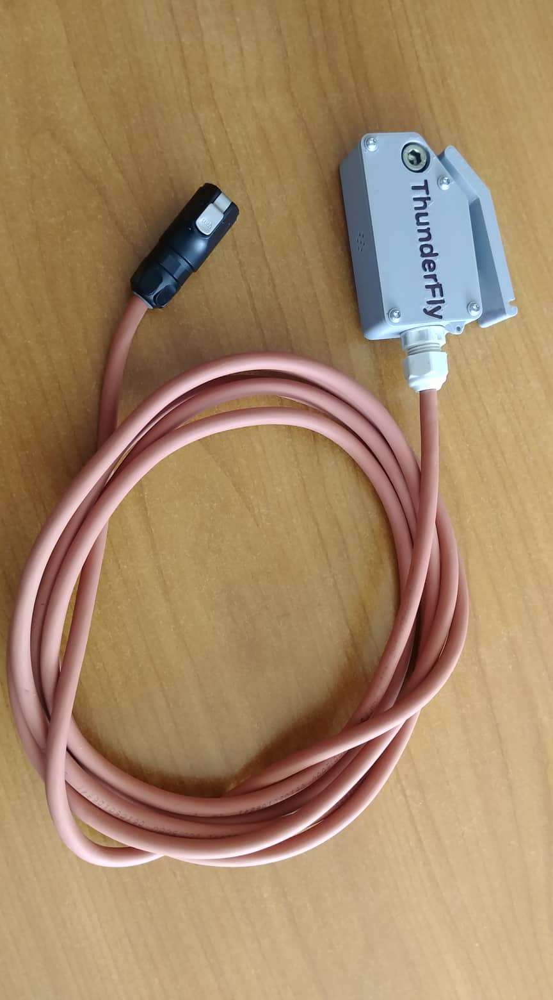
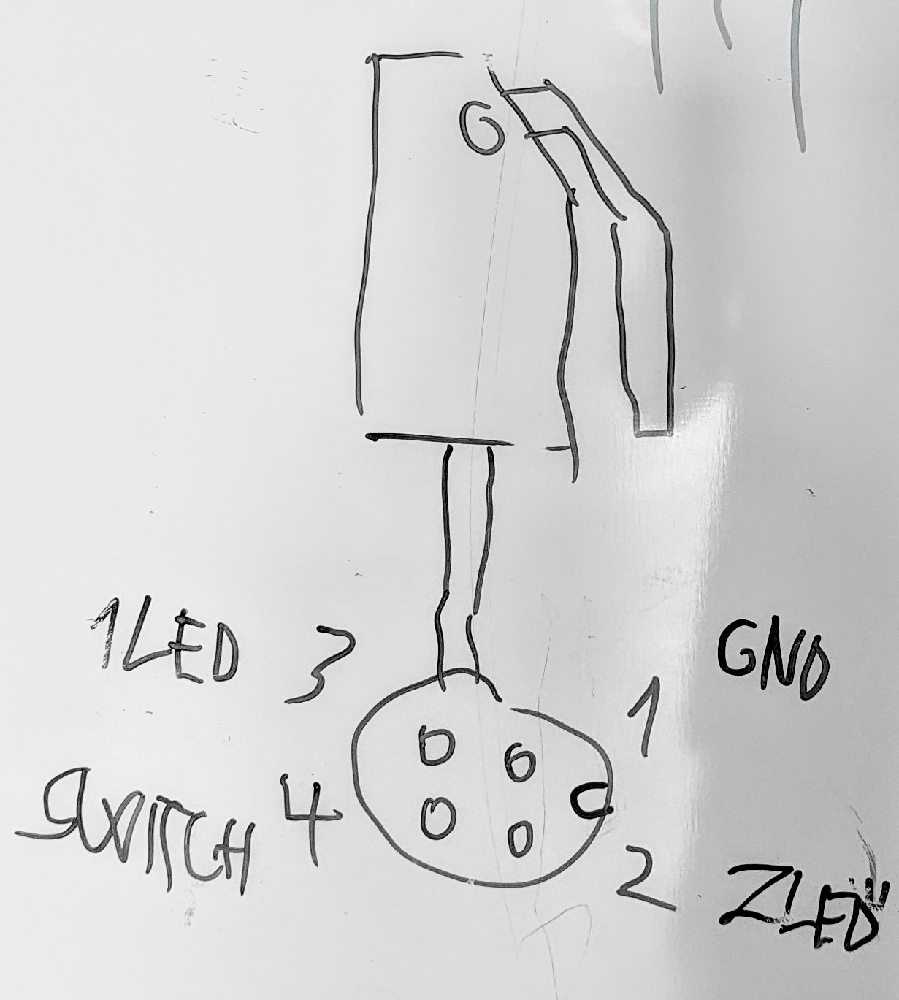

# Simple-platform

Device for launching unmanned drones (especialy autogyro type) from moving platforms (e.g. automobile roof).

The TF-SIMPLEPLATFORM is designed for launching of the unmanned [autogyro TF-G2](https://github.com/ThunderFly-aerospace/TF-G2/). Thanks to the combination of the this starting platform and the automatic takeoff mode of the TF-G2 unmanned autogyro, it is possible to perform safe and almost unattended takeoff. Platform is controlled from GCS based on realtime data from the UAV trough data-link. The platform can be disconnected manually (by operator) due to service operations.

## Parameters

| Parameter | Value | Note |
|----------|---------|----------|
| Platform type | Rigid mount | Aluminium profiles design |
| Actuator| Clamps | |
| Manual override | Button on platform | |
| Remote control interface | USB/UART | |
| Operator takeoff confirmation | Yes, remote button | |
| Control Software | Firmware, Mavlink interface in GCS | |
| Supported UAVs | [ThunderFly TF-G2](https://github.com/ThunderFly-aerospace/TF-G2) | |
| Supported flight stack | PX4 | |

## Clamps mount mechanism

## Usage

